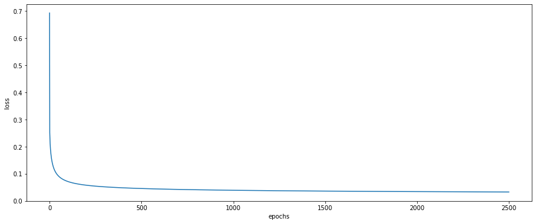

# AI_Internship
This is a simple email classification using Logistic Regression.

### Folder tree:
```
|   all_words.pickle
|   LogisticRegression.py
|   LogisticRegressionClass.py
|   LogisticRegressionVietnhh.ipynb
|   model.pickle
|   ProcessDataClassLR.py
|   README.md
|   WordEmbedding.py
|
+---data
|       sample_submission.csv
|       solution.csv
|       test.csv
|       train.csv
|
\---__pycache__


```
# Libraries
- sklearn.metrics
- pickle
- numpy
- time
- tqdm
- nltk
- gensim
- pandas
- matplotlib.pyplot

# Logistic Regression
```
cd logistic-regression
python LogisticRegression.py
```

# Word Embedding
Typically, we have 3 ways to implement Word2Vec for sentences of paragraph:

* Average
* Weighted Count Vectorizer
* Weighted Tf-idf Vectorizer

In this project we'll take the naive approach and use an average of all the words in the document.

# Results

 Plot loss during training
In this project we will train model with 2500 epochs and plot the loss value after each epochs using Matplotlib library.

<p align="center">

</p>

 I tried with many difference value of hyperparameters like learning rate, number of epochs,...
We see that loss decreases after epochs and that is to be expected of machine learning models.

# Evaluation model with train and test set

### Train
```
             precision    recall  f1-score   support

           0       0.93      0.92      0.92       480
           1       0.86      0.87      0.86       584
           2       0.84      0.86      0.85       591
           3       0.82      0.80      0.81       590
           4       0.88      0.88      0.88       578
           5       0.92      0.92      0.92       593
           6       0.88      0.90      0.89       585
           7       0.91      0.93      0.92       594
           8       0.96      0.96      0.96       598
           9       0.98      0.98      0.98       597
          10       0.99      0.99      0.99       600
          11       0.97      0.97      0.97       595
          12       0.88      0.83      0.86       591
          13       0.97      0.97      0.97       594
          14       0.98      0.97      0.97       593
          15       0.90      0.96      0.93       599
          16       0.94      0.96      0.95       546
          17       0.97      0.98      0.98       564
          18       0.92      0.91      0.91       465
          19       0.88      0.74      0.81       377

    accuracy                           0.92     11314
   macro avg       0.92      0.92      0.92     11314
weighted avg       0.92      0.92      0.92     11314
```

### Test
```
 precision    recall  f1-score   support

           0       0.74      0.70      0.72       319
           1       0.69      0.70      0.70       389
           2       0.69      0.65      0.67       394
           3       0.65      0.66      0.65       392
           4       0.73      0.77      0.75       385
           5       0.82      0.73      0.77       395
           6       0.78      0.82      0.80       390
           7       0.86      0.87      0.87       396
           8       0.94      0.90      0.92       398
           9       0.92      0.89      0.91       397
          10       0.92      0.96      0.94       399
          11       0.91      0.91      0.91       396
          12       0.66      0.67      0.66       393
          13       0.87      0.84      0.85       396
          14       0.90      0.91      0.90       394
          15       0.76      0.87      0.81       398
          16       0.70      0.86      0.77       364
          17       0.95      0.86      0.91       376
          18       0.65      0.56      0.60       310
          19       0.57      0.49      0.52       251

    accuracy                           0.79      7532
   macro avg       0.78      0.78      0.78      7532
weighted avg       0.79      0.79      0.79      7532
```

For more information about this project. Read my notebook at: 
https://github.com/nhhviet98/logistic-regression/blob/master/LogisticRegressionVietnhh.ipynb
